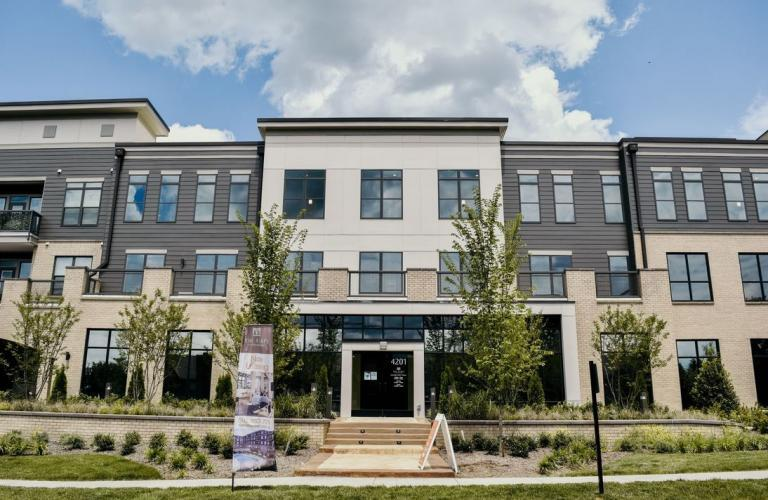

If you're in the market for building a new structure or renovating an existing one, it's important to work with a team that you can trust to bring your vision to life. Skynet Professional Solutions is here to provide that peace of mind and take your project from start to finish.

At Skynet, our experienced team of architects, builders, and engineers work together to bring your ideas to life. We understand the importance of staying within budget and timeline, which is why we work closely with you to create a detailed plan that incorporates your unique needs and goals.

  

  Whether you're building a new home, office, or commercial space, we have the expertise to make your project a reality. Our team stays up-to-date on the latest building and renovation trends and technologies to ensure that your space is not only functional but also aesthetically pleasing.

When it comes to renovations, we know that updating a space can be just as exciting as building a new one. Our team will work with you to determine the best plan of action to achieve your desired outcome, whether it's a complete remodel or simply updating fixtures and finishes.

  

At Skynet, we believe that communication is key. That's why we keep you informed throughout the entire process, from the initial consultation to the final walk-through. We take pride in our attention to detail and commitment to customer satisfaction, and it shows in the quality of our work.

Don't let your building or renovation project become overwhelming. Trust Skynet Professional Solutions to bring your vision to life. Contact us today to schedule a consultation and learn more about how we can help make your dream a reality.
